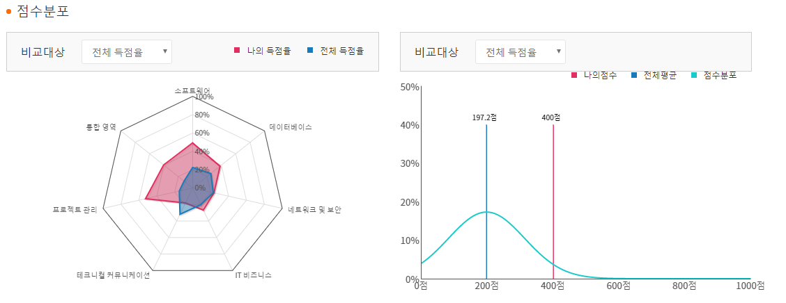

# 3학년 2학기

## 수강 과목
- 객체지향 모델링

- 시스템 프로그래밍

- 알고리즘

- 모바일 프로그래밍

- 데이터베이스 응용

## 테스팅 관련
- ISTQB 자격증 취득

  - [What is ISTQB?](https://www.sten.or.kr/bbs/board.php?bo_table=sten_ist)
  
- 크라우드 테스팅 경진대회 **대상 수상**

  - [전자신문 뉴스 원문 바로가기](http://etnews.com/20191115000335)

## 연구실 활동

- GAZEBO를 활용한 주행 시뮬레이션 시험장 구현

- ROS(Robot Operating System; 로봇 제어를 위한 메타 운영체제)를 활용한 자율 주행 시스템 구현

- TOPCIT 400점 획득

  - [What is TOPCIT?](https://www.topcit.or.kr)
  

## 수행 과제
- System Programming
  - [Programming Environment on Linux](https://github.com/yongjjang/Lab2)
  - [File processing & Process & Interprocess Communication Techniques on Linux](https://github.com/yongjjang/Lab3)
  - [socket & thread & GUI on Linux](https://github.com/yongjjang/Lab4)
  - [Shell Program](https://github.com/yongjjang/Shell-Program)
  - [Chatting Program Used Qt](https://github.com/yongjjang/Chatting-Program)

- Object Oriented Proramming
  - [Autonomous Driving System Used ROS](https://github.com/yongjjang/Autonomous-Driving-Car)
- Algorithm
  - ..
- Mobile Programming
  - [DayLight](https://github.com/InhwanJeong/DayLight) App
- Database
  - [Employee Management System](https://github.com/yongjjang/Employee-management-system)
